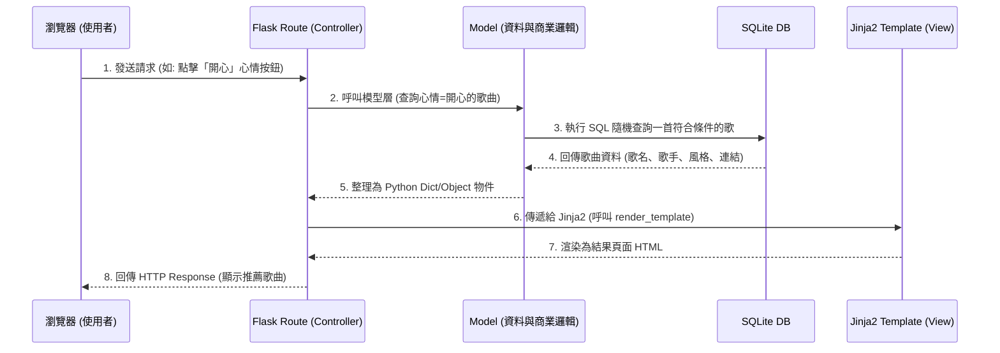

# 系統架構文件 (Architecture) - 心情選歌系統

## 1. 技術架構說明

本專案採用傳統的伺服器端渲染（Server-Side Rendering, SSR）架構進行開發，由後端框架一併處理業務邏輯與畫面渲染（不採用前後端分離）。

### **1.1 選用技術與原因**
- **後端框架：Python + Flask**
  - **原因**：Flask 是一套輕量級且靈活的框架，非常適合快速開發 MVP（最小可行產品）與中小型專案。它能輕鬆處理 HTTP 請求及路由配置，對於「心情選歌」這類功能明確的系統來說，開發效率極高。
- **模板引擎：Jinja2**
  - **原因**：與 Flask 高度整合，能夠在伺服器端將資料庫查詢到的變數（如歌曲資訊、心情標籤）直接注入到 HTML 頁面中，無需額外建置前後端 API 通訊機制。
- **資料庫：SQLite**
  - **原因**：設定簡單，無需另外架設與維護資料庫伺服器，資料以單一檔案（如 `database.db`）的形式存在，非常輕量，適合開發初期與小規模資料量。歌曲與標籤之間的多對多關聯可透過關聯式查詢輕鬆處理。

### **1.2 Flask MVC 模式說明**
雖然 Flask 本身沒有強制的目錄架構，但我們依循經典的 MVC（Model-View-Controller）模式概念來組織程式碼：
- **Model（模型）**：負責與 SQLite 資料庫溝通，處理資料的存取與商業邏輯（例如：根據心情標籤隨機查詢一首歌曲、新增歌曲資料、儲存使用者推薦等）。
- **View（視圖）**：負責使用者介面（UI）的呈現。在此系統中對應為放在 `templates/` 資料夾裡的 Jinja2 HTML 檔案，包含首頁選擇介面、結果頁面、推薦清單等。
- **Controller（控制器）**：在這裡對應為 Flask 的 **Routes（路由）**，負責接收使用者的請求（例如點選「開心」按鈕）、向 Model 要求隨機歌曲資料，接著將資料丟給 View (Jinja2) 去渲染，最終組成完整的網頁回傳。

---

## 2. 專案資料夾結構

以下是本專案的目錄結構規劃，將模組化拆分邏輯與視圖：

```text
web_app_development/
├── app.py                 # 應用程式入口點，負責啟動 Flask 伺服器
├── requirements.txt       # Python 套件相依清單 (開發時產出)
├── instance/              # 不進入版控的特定環境檔案
│   └── database.db        # SQLite 資料庫儲存檔
├── app/                   # 核心專案內文
│   ├── __init__.py        # 建立 Flask App、註冊設定檔與 Blueprints
│   ├── models/            # 【Model】資料庫結構定義
│   │   ├── __init__.py
│   │   ├── song.py        # 歌曲資料表模型（歌名、歌手、風格、試聽連結）
│   │   ├── tag.py         # 標籤資料表模型（心情標籤、天氣標籤）
│   │   └── recommend.py   # 使用者推薦資料表模型（推薦歌曲、推薦原因）
│   ├── routes/            # 【Controller】路由處置
│   │   ├── __init__.py
│   │   ├── main.py        # 首頁、心情/天氣選擇、結果頁面路由
│   │   ├── recommend.py   # 他人推薦曲目瀏覽與提交推薦路由
│   │   └── admin.py       # 管理員登入與歌曲 CRUD 後台路由
│   ├── templates/         # 【View】Jinja2 HTML 模板
│   │   ├── base.html      # 共用基本排版 (含 navbar, footer 等)
│   │   ├── index.html     # 首頁 (心情 & 天氣按鈕選擇介面)
│   │   ├── result.html    # 選歌結果頁面 (顯示推薦歌曲資訊)
│   │   ├── recommend/     # 他人推薦相關頁面
│   │   │   ├── list.html  # 推薦曲目清單頁面
│   │   │   └── form.html  # 提交推薦歌曲表單頁面
│   │   └── admin/         # 管理員後台頁面
│   │       ├── login.html # 管理員登入頁面
│   │       ├── dashboard.html # 歌曲管理儀表板
│   │       └── song_form.html # 新增/編輯歌曲表單
│   └── static/            # 靜態資源檔案
│       ├── css/
│       │   └── style.css  # 全站共通樣式
│       └── js/
│           └── main.js    # 客製化互動操作（如動態背景效果）
├── docs/                  # 文件管理
│   ├── PRD.md             # 產品需求文件
│   ├── ARCHITECTURE.md    # 系統架構文件 (本檔案)
│   └── FLOWCHART.md       # 流程圖文件
└── seed_data.py           # 初始化種子資料腳本（預填歌曲資料庫）
```

---

## 3. 元件關係圖

以下展示瀏覽器發出請求後，系統內部各個元件如何運作互動：



---

## 4. 關鍵設計決策

1. **不採用前後端分離架構**
   - **原因**：為了能快速產出 MVP（Minimum Viable Product）進行驗證，降低專案的複雜度。使用 Flask 與 Jinja2 共構，能省去建置前後端通訊 API、跨域（CORS）問題以及撰寫 API 文件的成本。心情選歌系統的互動邏輯相對單純，SSR 即可滿足需求。

2. **歌曲與標籤採用多對多關聯設計**
   - **原因**：一首歌可以同時屬於多種心情（例如既適合「放鬆」也適合「開心」），一種心情也對應多首歌曲。同理，天氣標籤也是如此。使用關聯表（如 `song_mood`、`song_weather`）來建立多對多關係，能讓推薦查詢更加靈活精準。

3. **區段式藍圖路由開發 (Flask Blueprints)**
   - **原因**：將應用切分為「主功能」(`main`)、「推薦系統」(`recommend`) 與「後台管理」(`admin`) 三個 Blueprint，避免所有邏輯堆在 `app.py` 導致過於肥大，讓日後擴充新功能（如組合篩選、歷史紀錄）更容易維護。

4. **種子資料腳本 (`seed_data.py`)**
   - **原因**：系統的核心體驗仰賴足夠數量的歌曲資料。透過獨立的種子資料腳本，在初始化時即可預填入大量歌曲（每種心情/天氣至少 5 首），確保系統從一開始就能提供有意義的推薦結果，而非空白的資料庫。

5. **模組化的模板繼承 (Template Inheritance)**
   - **原因**：將導覽列、頁尾、樣式檔等共同區塊抽取至 `base.html`，其餘各頁面（首頁、結果頁、推薦清單頁、後台頁面）繼承後只需填入專屬的 Block 內容。這能極大化減少重複的 HTML 程式碼，若要調整全站風格也只需修改唯一的基礎模板。
