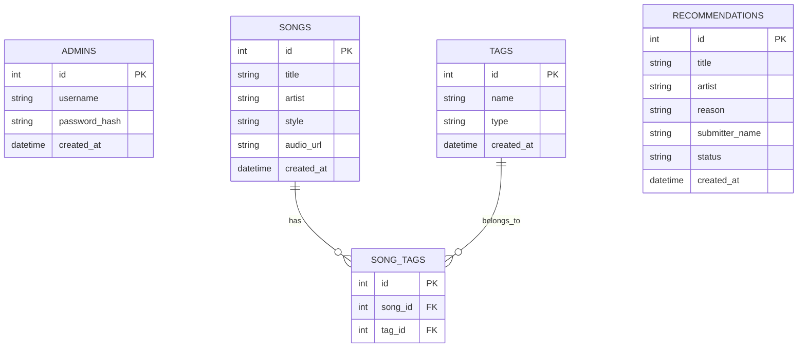

# 資料庫設計文件 (DB_DESIGN)

## 1. ER 圖（實體關係圖）

## 2. 資料表詳細說明

### 2.1 `admins` (管理員表)
儲存管理員登入資訊。
- `id` (INTEGER, PK): 主鍵，自動遞增。
- `username` (TEXT): 帳號名稱，必填，唯一。
- `password_hash` (TEXT): 加密後的密碼，必填。
- `created_at` (DATETIME): 建立時間。

### 2.2 `songs` (歌曲表)
儲存系統提供的歌曲清單。
- `id` (INTEGER, PK): 主鍵，自動遞增。
- `title` (TEXT): 歌名，必填。
- `artist` (TEXT): 歌手，必填。
- `style` (TEXT): 歌曲風格（選填）。
- `audio_url` (TEXT): 試聽連結或嵌入網址（選填）。
- `created_at` (DATETIME): 建立時間。

### 2.3 `tags` (標籤表)
儲存所有的心情與天氣標籤。
- `id` (INTEGER, PK): 主鍵，自動遞增。
- `name` (TEXT): 標籤名稱（如：happy, sad, sunny, rainy），必填，唯一。
- `type` (TEXT): 標籤類型，限制為 `mood` 或 `weather`。
- `created_at` (DATETIME): 建立時間。

### 2.4 `song_tags` (歌曲標籤關聯表)
處理 `songs` 與 `tags` 的多對多關聯（涵蓋心情與天氣）。
- `id` (INTEGER, PK): 主鍵，自動遞增。
- `song_id` (INTEGER, FK): 外鍵對應 `songs.id`。
- `tag_id` (INTEGER, FK): 外鍵對應 `tags.id`。

### 2.5 `recommendations` (他人推薦表)
儲存使用者在前台提交的推薦歌曲。
- `id` (INTEGER, PK): 主鍵，自動遞增。
- `title` (TEXT): 歌名，必填。
- `artist` (TEXT): 歌手，必填。
- `reason` (TEXT): 推薦原因（選填）。
- `submitter_name` (TEXT): 提供者暱稱（選填）。
- `status` (TEXT): 審核狀態（值：`pending`, `approved`, `rejected`），預設 `pending`。
- `created_at` (DATETIME): 建立時間。

## 3. SQL 建表語法
建表語法已儲存於 `database/schema.sql` 檔案中。

## 4. Python Model 程式碼
Model 已使用 `sqlite3` 開發，對應的 CRUD 方法位於 `app/models/` 目錄底下。
