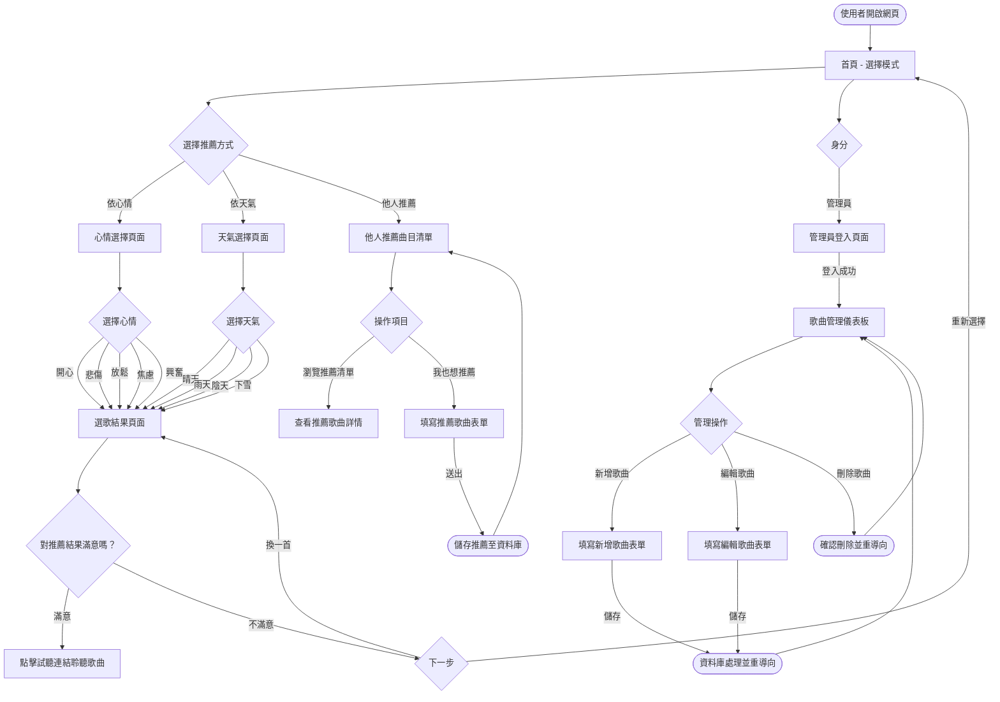
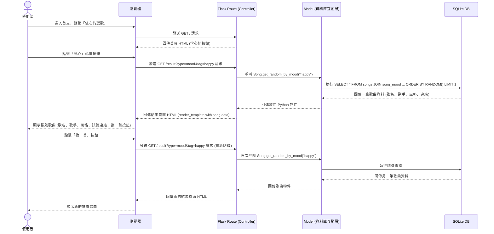

# 系統流程圖與使用者操作路徑 (Flowcharts) - 心情選歌系統

以下文件根據現有的 [PRD.md](./PRD.md) 和 [ARCHITECTURE.md](./ARCHITECTURE.md) 設計，透過視覺化圖表釐清使用者的操作路徑與後端的資料流，並定義出各個功能的對應路由。

## 1. 使用者流程圖（User Flow）

此流程圖呈現一般使用者從進入網站開始，可能採取的各項操作行為。包含了「心情選歌」、「天氣選歌」、「他人推薦」以及「管理員後台」等核心情境。

## 2. 系統序列圖（Sequence Diagram）

此圖以「**使用者依心情選歌**」這項核心操作為例，詳細描繪整個系統後端（MVC 架構）的運作順序——從使用者點擊心情按鈕到顯示推薦歌曲的完整流程。

## 3. 功能清單對照表

本清單列出所有將實作的功能，以及對應的 URL 路徑 (Routes) 和 HTTP 請求方法。由於原生 HTML 表單僅支援 GET 與 POST，故我們在更新/刪除資源時會透過 `POST` 方法加上特定後綴路徑來實作。

| 功能模塊 | 具體功能描述 | HTTP 方法 | URL 路徑 (Route) | 備註 |
| --- | --- | --- | --- | --- |
| **首頁與選歌** | 網站首頁（心情 & 天氣選擇介面） | GET | `/` | 顯示心情按鈕與天氣按鈕 |
| | 選歌結果頁面 | GET | `/result?type=mood&tag=<tag>` | 依心情隨機推薦一首歌 |
| | 選歌結果頁面 | GET | `/result?type=weather&tag=<tag>` | 依天氣隨機推薦一首歌 |
| | 換一首（重新隨機） | GET | `/result?type=<type>&tag=<tag>` | 相同參數重新查詢即可 |
| | 重新選擇（回首頁） | GET | `/` | 導回首頁重新選擇 |
| **他人推薦** | 推薦曲目清單頁面 | GET | `/recommendations` | 瀏覽所有使用者推薦的歌曲 |
| | 提交推薦歌曲表單頁面 | GET | `/recommendations/new` | 顯示空白推薦表單 |
| | 儲存推薦歌曲 | POST | `/recommendations` | 將推薦資料寫入資料庫 |
| **管理員後台** | 管理員登入頁面 | GET / POST | `/admin/login` | 含登入表單渲染(GET)與驗證(POST) |
| | 管理員登出 | GET | `/admin/logout` | 清除管理員 Session |
| | 歌曲管理儀表板 | GET | `/admin/songs` | 列出所有歌曲供管理 |
| | 新增歌曲表單頁面 | GET | `/admin/songs/new` | 提供空白輸入表單 |
| | 儲存新歌曲 | POST | `/admin/songs` | 將歌曲資料寫入資料庫 |
| | 編輯歌曲表單頁面 | GET | `/admin/songs/<int:song_id>/edit` | 填入既有資料供修改 |
| | 儲存修改的歌曲 | POST | `/admin/songs/<int:song_id>/update` | 更新歌曲資料 |
| | 刪除歌曲 | POST | `/admin/songs/<int:song_id>/delete` | 驗證權限後刪除歌曲 |
